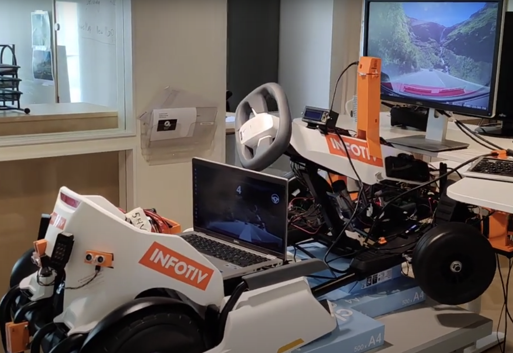

# Autonomous Drive
The Autonomous Drive in GoKart is based on OpenPilot project. 

> “openpilot is an open source driver assistance system. Currently, openpilot performs the functions of Adaptive Cruise Control (ACC), Automated Lane Centering (ALC), Forward Collision Warning (FCW), and Lane Departure Warning (LDW) for a growing variety of supported car makes, models, and model years. In addition, while openpilot is engaged, a camera-based Driver Monitoring (DM) feature alerts distracted and asleep drivers. See more about the vehicle integration and limitations.” (https://github.com/commaai/openpilot)


## OpenPilot Integration
The Integration uses code from the bridge that allows it to run OpenPilot in the CARLA simulator. The modification made it possible to use the camera images and use of `gokart_controller` python library to control the GoKart through ROS APIs.





```bash
git clone git@github.com:ebadi/openpilot_gokart.git --recursive
cd openpilot-webcam/tools/sim
./build_container.sh
./start_openpilot_docker.sh
```
If there is any issue with the images shown on the dashboard (black image on dashboard or use of the incorrect camera):

- Make sure that the camera is connected to the machine (use `cheese` to verify that). 
- Make sure that the camera device (`--device /dev/videoX`) is passed to the docker container in `start_openpilot_docker.sh` 
- check that the right camera is selected in the `gokart.py`:
```
def webcam(camerad: Camerad, exit_event: threading.Event):
  ...
  cap = cv2.VideoCapture(6) #set camera ID here, index X in /dev/videoX
  ...
```

Running the docker container results in several scripts to be executed in parallel (`see tmux_script.sh`). You can switch between them using `~` key or the combination of keys like: `~ + 1` for terminal one, `~ + 2` for terminal two, etc. 

If there are communication issues please make sure that the IP addresses and the hostname for ROS_MASTER_URI, ROS_IP and node_uri are correctly specified in `tmux_script.sh` and `gokart.py`. 

** Please note that it is not always possible to use the hostname `dobby.local` inside the docker. **

To stop the docker container:
```bash
docker kill openpilot_client
```

