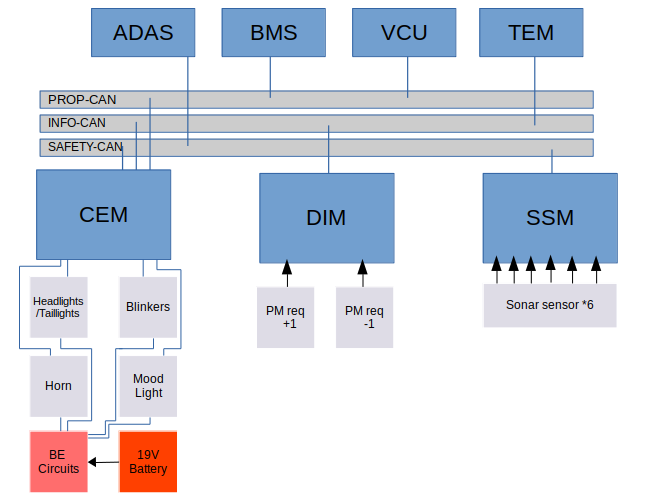
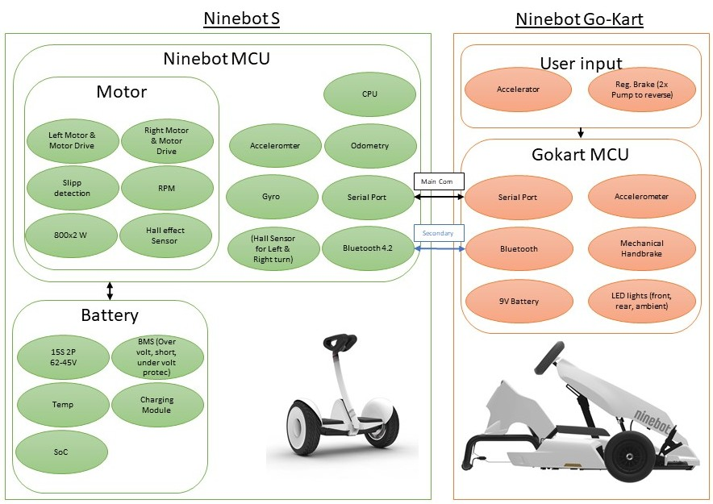
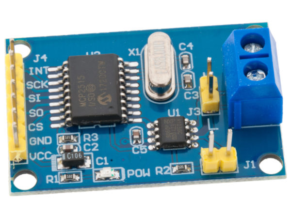
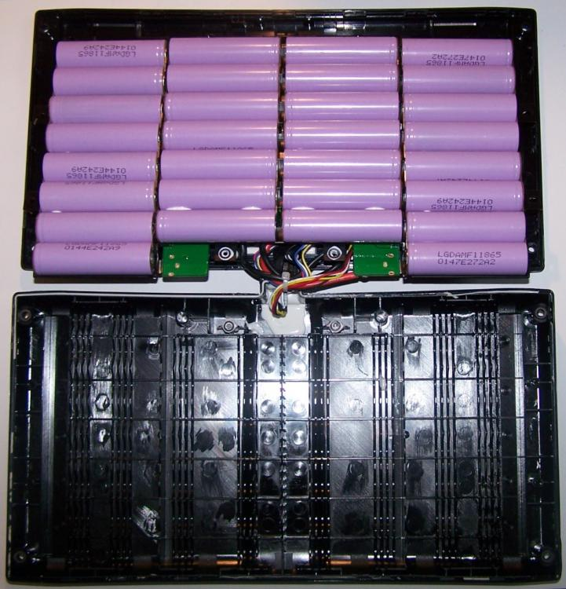

# Main Hardware Components

- ECUs: CEM, ADAS, BMS, ECM/VCU, OBC, DC/DC, IHU, TEM
- Radar (4)
- Lidar (1)
- Ultrasonic (4)
- Camera (1)
- (Stereo vision (1))
- HV – battery (1)
- LV – battery (1)
- Motors (4)
- Wheel speed sensors (4)
- OBD2 connector (1)
- Charging connector (1)
- “GPS” (no function)
GoKart




* Ninebot S
* Ninebot Go-Kart: [Manual](assets/images/ninebot-gokart/User_Manual_Gokart_Kit_Updated.pdf),  [Manufacturer](https://store.segway.com/segway-ninebot-gokart-kit)



More information about the internals: 
[Segway miniPRO Teardown](https://www.fictiv.com/teardowns/segway-minipro-teardown)

Communication between these parts are analysed in the `protectedDocuments/Gokart Serielanalys/Kommunikation för Gokart.docx` **([Protected document](contact.md))**

## NVIDIA Jetson TX2 Developer Kit
Find a backup of the image in `TODO` **([Protected document](contact.md))**.
The username for the image is `gokart1` and the password is **([Protected document](contact.md))**.
```bash
$ uname -an
Linux dobby 4.9.140-tegra #1 SMP PREEMPT Tue Oct 27 21:02:46 PDT 2020 aarch64 aarch64 aarch64 GNU/Linux

$ ps aux | grep ros
gokart1   5668  0.4  0.7 283996 56980 ?        Sl   12:45   0:04 /usr/bin/python /opt/ros/melodic/bin/roscore
gokart1   6559  0.4  0.6 798264 54952 ?        Ssl  12:45   0:03 /usr/bin/python /opt/ros/melodic/bin/rosmaster --core -p 11311 -w 3 __log:=/home/gokart1/.ros/log/1381b99e-ebcf-11ec-8300-65d39938f186/master.log
gokart1   6577  0.3  0.1 338648  9548 ?        Ssl  12:45   0:03 /opt/ros/melodic/lib/rosout/rosout __name:=rosout __log:=/home/gokart1/.ros/log/1381b99e-ebcf-11ec-8300-65d39938f186/rosout-1.log
gokart1   6587  0.0  0.0   1912  1192 ?        Ss   12:45   0:00 /bin/sh -c . /opt/ros/melodic/setup.sh; . /etc/ros/env.sh; . /home/gokart1/SSD/ROS_projects/RosCanBus/devel/setup.sh; rosrun roscanbus roscanbus_node
gokart1   6588  0.0  0.0   1912  1212 ?        Ss   12:45   0:00 /bin/sh -c . /opt/ros/melodic/setup.sh; . /etc/ros/env.sh; roslaunch usb_cam vision_stack.launch
gokart1   6596  0.0  0.0   1912  1124 ?        Ss   12:45   0:00 /bin/sh -c . /opt/ros/melodic/setup.sh; . /etc/ros/env.sh; roslaunch rplidar_ros rplidar.launch
gokart1   6703  0.4  0.6 283360 54376 ?        Sl   12:45   0:03 /usr/bin/python /opt/ros/melodic/bin/roslaunch usb_cam vision_stack.launch
gokart1   6704  0.4  0.6 283360 54692 ?        Sl   12:45   0:03 /usr/bin/python /opt/ros/melodic/bin/roslaunch rplidar_ros rplidar.launch
gokart1   6725 12.6  0.2 363692 17588 ?        Sl   12:45   1:45 /home/olle/SSD/ROS_projects/RosCanBus/devel/lib/roscanbus/roscanbus_node
gokart1   7202  1.0  0.1 347056 11700 ?        Ssl  12:45   0:08 /opt/ros/melodic/lib/rplidar_ros/rplidarNode __name:=A2_lidar_node __log:=/home/gokart1/.ros/log/1381b99e-ebcf-11ec-8300-65d39938f186/A2-A2_lidar_node-1.log
gokart1   7207  5.1  0.1 347056  9788 ?        Ssl  12:45   0:42 /opt/ros/melodic/lib/rplidar_ros/rplidarNode __name:=S1_lidar_node __log:=/home/gokart1/.ros/log/1381b99e-ebcf-11ec-8300-65d39938f186/S1-S1_lidar_node-2.log
gokart1   7225  0.3  0.7 451228 58924 ?        Ssl  12:45   0:02 /opt/ros/melodic/lib/image_proc/image_proc __name:=image_proc __log:=/home/gokart1/.ros/log/1381b99e-ebcf-11ec-8300-65d39938f186/usb_cam-image_proc-2.log
gokart1   8437  0.5  0.5 461908 45180 ?        Sl   12:46   0:04 gedit /home/gokart1/hamid/rostopic.txt
gokart1   8781  0.5  0.6 361616 54632 pts/0    Sl+  12:47   0:03 /usr/bin/python2 /opt/ros/melodic/bin/rostopic pub /Speed_Request_Turn std_msgs/Float32 10
gokart1   9503  0.0  0.0   7216   644 pts/2    S+   12:59   0:00 grep --color=auto ros

```
## STM32F103C8T6 - ”Blue Pill” Development Board

The Blue Pill is a development board based on ST Microelectronics’ STM32F103C8T6 microcontroller that has an ARM Cortex-M3 core that runs at 72MHz max. Most of the ECUs on the Infotiv Autonomous Platform, including the CEM, ADAS_DK and VCU are based on STM32s, coded in C++ in Infotiv’s own embedded framework.


Check this document for start-up guide for autonomous platform and STM32 `2019 - Praktik, Elschema och BOM för bilplatform/Platform V1/Bilplattform_STM32.pdf` **([Protected document](contact.md))**


## Arduino Nano
The Arduino Nano is a small, complete development board based on the ATmega328 (Arduino Nano 3. x). It has more or less the same functionality as the Arduino Uno, but in a different package. It was used for the simple task of the CEM_DK (Power Mode requests + screen feedback) due to it’s small physical footprint.

## MCP2515 / TJA1050 CAN transceiver
This module combines the MCP2515 CAN controller with the TJA1050 CAN transceiver to a standalone unit that connects directly to the CAN-bus on one end and via SPI to the microcontroller on the other end. Most ECUs on the Autonomous Platform use one of these modules for CAN communication, and the CEM is equipped with three CAN transceivers, one for each bus.




## HC-SR04 sonar sensor
This sensor uses ultrasonic sound to measure distance to objects in it’s way. It’s working range is specified to between 20 to 4000 mm. It’s simple to set up but has a drawback in it’s quite narrow field of vision. To compensate for this we use six sensors on the Gokart.

## EMG49 - Gear motor with encoder


## 3D printed parts
Find the 3D model files in `protectedDocuments/2020 - Infotiv Autonomous Platform, Body Electronics Intern work Package/Gokart 3D models` folder   **([Protected document](contact.md))**

## Battery and Battery Monitoring System

To power the Body Electronics circuit require a battery of type Lipo 5000mAh 5S 25C Lipo Pack w/XT90. A LM2596 buck converter is used to step down the voltage from the battery to 12V powering the circuit
The ECUs are powered by another Lipo battery with another buck converter that steps down to 5V.

- HV – battery
- LV – battery

Turnigy nano-tech 4000mah 3S 25~50C Lipo Pack w/XT-60

")



2021 Gokart schematics

Battery Monitoring System PCB Schematics are available at `protectedDocuments/2021 Gokart schematics` **([Protected document](contact.md))**
