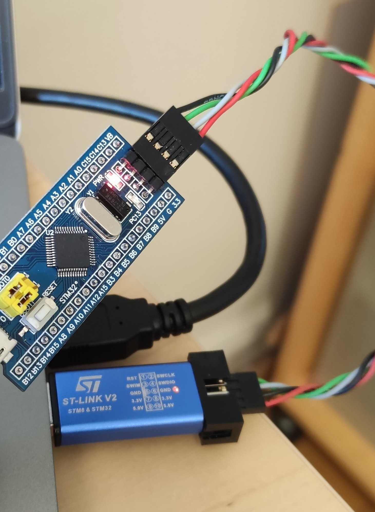

#### building RosCanBus

```
root of the ROSCANBUS project is /home/olle/SSD/ROS_projects/RosCanBus/src/roscanbus for building the project

# To run the ruscanbus node:
kill -9 `pidof roscanbus_node` ; kill -9 `pidof roscore`  ; roscore &

kill -9 `pidof roscanbus_node` ; source /opt/ros/melodic/setup.sh; cd /home/olle/SSD/ROS_projects/RosCanBus; /home/olle/SSD/ROS_projects/RosCanBus/src/roscanbus/build/devel/lib/roscanbus/roscanbus_node

```

#### Services 

To install services you need to use the [following repository](https://gitlab.infotivlab.se/internal-development/autonomous-platform/gokart/gokart_setup):

`/etc/systemd/system/`


```txt
[Unit]
After=roscore.service
After=NetworkManager.service time-sync.target

[Service]
User=gokart1
WorkingDirectory=/home/gokart1/SSD/ROS_projects/RosCanBus
ExecStart=/bin/sh -c ". /opt/ros/melodic/setup.sh; . /etc/ros/env.sh; /home/olle/SSD/ROS_projects/RosCanBus/src/roscanbus/build/devel/lib/roscanbus/roscanbus_node"

[Install]
WantedBy=multi-user.target
```


```bash
sudo systemctl enable roscanbus.service
sudo systemctl start  roscanbus.service
sudo systemctl status roscanbus.service
```


#### gokart_controller on remote client machine

** Make sure roscanbus_node is running on GoKart **

```bash
sudo apt-get install -y ros-sensor-msgs 
export ROS_MASTER_URI=http://dobby.local:11311
export ROS_IP=192.168.150.XXX   # ip address of the client machine

source /opt/ros/noetic/setup.bash  ############## VERY IMPORTANT
cd gokart_controller

python3 test.py 

```


#### Local git setup


```txt
Host gitlab.infotivlab.se
    Hostname 10.0.4.27
    IdentityFile ~/.ssh/id_rsa
    User git

```


#### STM32 Blue Pill Development environment
```
sudo apt-get install gcc-arm-none-eabi libnewlib-arm-none-eabi
arm-none-eabi-newlib # arch 

apt-get install openocd

Install Visual Studio Code
    a. sudo apt update
    b. sudo apt install snapd
    c. sudo snap install --classic code
Install apps
	sudo apt install git openocd gdb-multiarch gcc-arm-none-eabi libnewlib-arm-none-eabi
Link together multiarch and gdb
    a. Find path of "gdb-multiarch", should be /usr/bin/gdb-multiarch
    b. sudo ln -s /usr/bin/gdb-multiarch /usr/bin/arm-none-eabi-gdb
	
Install build essential
	sudo apt-get install build-essential
	
Install st-link drivers
    a. sudo apt install git
    b. sudo apt install cmake
    c. sudo apt install gcc
    d. sudo apt install libusb-1.0
    e. git clone https://github.com/texane/stlink.git
    f. cd stlink
    g. make release
    h. cd build/Release
    i. sudo make install 
Connect ST-Link to STM32
			
	ST-Link	STM32

	Pin 1 		3v3
	Pin 7		SWIO
	Pin 9		SWCLK	
	Pin 20		GND


Install plugins
    a. Start VS code by typing "code" in terminal
    b. Ctrl+shift+x in VS code and install extensions C/C++ and Cortex-Debug
    c. If you are not working with the CEM, exchange the statements in the launch.json to correspond with the module you are working with (BMS, VCU etc)

Download repository
    a. git clone HTTPS_link
       git clone -b branch_name HTTPS_link (specific branch)
    b. cd into directory
    c. git submodule update –recursive  --init 
	
Create .elf 
    a. make gen_all
    b. make

First test
    a. Open the autonomous platform folder in VS code
    b. Make sure the STM32 is connected via USB and ST-link
    c. Start debugging (f5)
    d. This should build the project, upload it to the STM32, the ST-link should start blinking G/R and once uploaded the led on the STM should blink at 1Hz.
       

```


#### ST-LINK dongle to the Blue Pill connection


#### Flash VCPU



Create a file called openocd.cfg
```txt
source [find interface/stlink-v2.cfg]
source [find target/stm32f1x.cfg]
```
and run `openocd -f openocd.cfg`:
```console
Open On-Chip Debugger 0.10.0
Licensed under GNU GPL v2
For bug reports, read
	http://openocd.org/doc/doxygen/bugs.html
Info : auto-selecting first available session transport "hla_swd". To override use 'transport select <transport>'.
Info : The selected transport took over low-level target control. The results might differ compared to plain JTAG/SWD
adapter speed: 1000 kHz
adapter_nsrst_delay: 100
none separate
Info : Unable to match requested speed 1000 kHz, using 950 kHz
Info : Unable to match requested speed 1000 kHz, using 950 kHz
Info : clock speed 950 kHz
Info : STLINK v2 JTAG v29 API v2 SWIM v7 VID 0x0483 PID 0x3748
Info : using stlink api v2
Info : Target voltage: 3.253369
Info : stm32f1x.cpu: hardware has 6 breakpoints, 4 watchpoints
```

Patch for gokart_vcu:

```txt
update platform/arch/stm32/board/stm32f103board.mk

from 
	openocd -f board/stm32f103bp.cfg -c "program $(BUILDDIR)/$(PROJECT_NAME).elf verify reset exit"

to 
	openocd -f openocd.cfg -c "program $(BUILDDIR)/$(PROJECT_NAME).elf verify reset exit"
```

```bash
make clean
make 
make gen_all
make upload_stlink # make upload for st_nucleo
```

Should results in:
```bash
openocd -f openocd.cfg -c "program build-stm32f103board/VCU.elf verify reset exit"
Open On-Chip Debugger 0.10.0
Licensed under GNU GPL v2
For bug reports, read
	http://openocd.org/doc/doxygen/bugs.html
Info : auto-selecting first available session transport "hla_swd". To override use 'transport select <transport>'.
Info : The selected transport took over low-level target control. The results might differ compared to plain JTAG/SWD
adapter speed: 1000 kHz
adapter_nsrst_delay: 100
none separate
Info : Unable to match requested speed 1000 kHz, using 950 kHz
Info : Unable to match requested speed 1000 kHz, using 950 kHz
Info : clock speed 950 kHz
Info : STLINK v2 JTAG v38 API v2 SWIM v7 VID 0x0483 PID 0x3748
Info : using stlink api v2
Info : Target voltage: 2.869531
Info : stm32f1x.cpu: hardware has 6 breakpoints, 4 watchpoints
target halted due to debug-request, current mode: Thread 
xPSR: 0x01000000 pc: 0x080048c4 msp: 0x20004ffc
** Programming Started **
auto erase enabled
Info : device id = 0x20036410
Info : flash size = 64kbytes
target halted due to breakpoint, current mode: Thread 
xPSR: 0x61000000 pc: 0x2000003a msp: 0x20004ffc
wrote 21504 bytes from file build-stm32f103board/VCU.elf in 1.232481s (17.039 KiB/s)
** Programming Finished **
** Verify Started **
target halted due to breakpoint, current mode: Thread 
xPSR: 0x61000000 pc: 0x2000002e msp: 0x20004ffc
target halted due to breakpoint, current mode: Thread 
xPSR: 0x61000000 pc: 0x2000002e msp: 0x20004ffc
verified 20656 bytes in 0.355877s (56.682 KiB/s)
** Verified OK **
** Resetting Target **
shutdown command invoked
make[1]: Leaving directory '/home/hamid/repositories/GOKART/gokart_vcu'
```


#### Debug messages
To see the debug messages that are shown in the serial port with `logger.error()` function:
```bash
sudo miniterm /dev/ttyUSB0 115200

[33;1m[WARNING]␛[0m No message from CAN. Restarting MCP2515
```


#### SSH keys

There are already one ssh key added as an auithorized key to the gokart. copy the content of `/protectedDocuments/SSHKeys` **([Protected document](contact.md))** to `~/.ssh/` directory. You will be able to connect to gokart without using password as below

```bash
ssh gokart1@dobby.local
```

As an example you can shutdown the jetson board  like this:
```bash
ssh gokart1@dobby.local "shutdown -h now"
```

#### Patches

Patches for fixing the issue with remote control
```
void RcView::updateSpeedPulse() 
{
	speedData_ = RC_SPEED_INPUT.get();
	if(speedData_ == 1 && previousSpeedData_ != 1)
	{
		speedStartTime_ = get_system_time_ns();
	}
	else if(speedData_ == 0 && previousSpeedData_ == 1)
	{
		speedEndTime_ = get_system_time_ns();
        if(speedEndTime_ - speedStartTime_ > minSpeedPulse_ && speedEndTime_ - speedStartTime_ < maxSpeedPulse_) //Remove all misscalculations when timer overflows.
        {
            speedPulse_ = speedEndTime_ - speedStartTime_;
			float speedReq = linearConversion(speedPulse_, minSpeedPulse_, maxSpeedPulse_, 0, 1);

        	if (speedReq > 1) speedReq = 1;
        	else if (speedReq < 0) speedReq = 0;

        	if(speedReq > 0.55) //Acceleration signal
        	{
				speedReq = (speedReq - 0.55) / (0.45);
				gokartModel_->setSpeedRequest(speedReq);
        	}
			else if(speedReq < 0.45) //brake signal
			{
				float brake_req = (speedReq / 0.45); 
				gokartModel_->setBrakeRequest(brake_req);
			}
			else
			{
				gokartModel_->setSpeedRequest(0);
				gokartModel_->setBrakeRequest(0);
			}
			
        }
	}
	previousSpeedData_ = speedData_;
}

```


The left steering is not implemented correctly or NOT at all

1. gokart_controller / gokart_controller.py
```
     def set_power_enable(self):
        raise NotImplementedError

    def set_speed(self, speed):
        raise NotImplementedError

    def set_turn_rate(self, degrees):
        raise NotImplementedError
```

2. last commit on gokart/Gokart_VCU
```
src/controllers/GokartController.cpp  

- #define minTurnPWM_ 0.069
- #define maxTurnPWM_ 0.051
+ #define minTurnPWM_ 0.074
+ #define maxTurnPWM_ 0.047

src/views/RcView.h 

-  static const int minTurnPulse_ = 1130000;
-  static const int maxTurnPulse_ = 1930000;
+  static const int minTurnPulse_ = 1050000;
+  static const int maxTurnPulse_ = 1850000;
```
