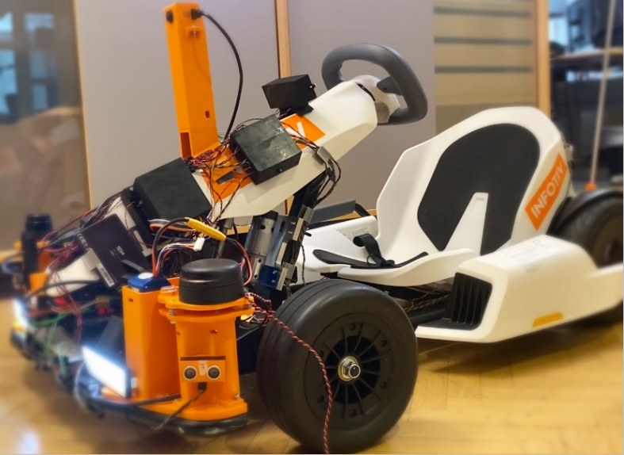

# Infotiv Autonomous Platform
To increase the knowledge and expertise within the evolving automotive industry Infotiv developed the Infotiv Autonomous Platform. A multitude of thesis works, internships, and internal projects have been done with this platform and this has bettered Infotiv’s competitive edge. The end goal of this series of projects is to have an autonomous go-kart, be it in a controlled test environment, that furthers development and research in the autonomous vehicle industry. When the gokart platform reaches a stable state, external research entities could use the platform to test and verify their ideas.

Developing a platform that is closer to a car opens a multitude of developing opportunities as well as increases the value of the existing project, proving scalability. The research and development are done on the new gokart till face more similar issues as the industry are facing. Infotiv having this knowledge and how to solve these issues would further increase Infotiv’s competitive edge.
This platform will also allow the development of other types of driver-focused applications, some examples being lane assistance, driver interface, and adaptive cruise control. 

The goal of the project is to add a driver assistance system capable of performing functions such as Adaptive Cruise Control (ACC), Automated Lane Centering (ALC), Forward Collision Warning (FCW), and Lane Departure Warning (LDW) to the existing GoKart framework. The GoKart was the result of previous research within Infotiv.

# System Architecture
The system is designed in three steps as a separated projects. 

1. [Automotive platform](platform.md)
2. [Body electronics](bodyelec.md)
3. [Autonomous Drive](autonomous.md)

Download the PDF catalog here. 

