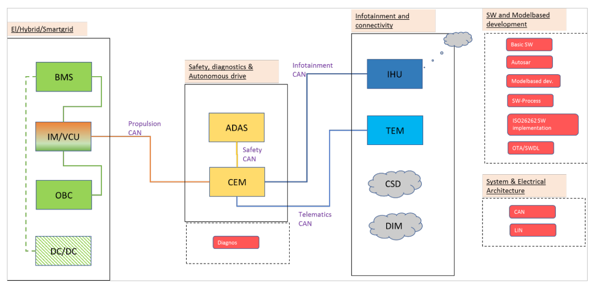

# Automotive Platform ECUs
Automotive Platform consist of several ECUs and the purpose of these ECUs (CEM, ADAS, BMS, ECM/VCU, OBC, DC/DC, IHU, TEM) are best described in `/protectedDocuments/Infotiv Research and Education Go-kart Platform/Old Product & Functional Description of IES Education platform.docx` **([Protected document](contact.md))**

System Overview:


The platform includes three different CAN bus-systems:

- Propulsion CAN
- Safety CAN
- Infotainment CAN


The communication between these three CAN buses shall all be routed through the CEM, which will act as gateway and general body electronics module.

## ECU function level

### CEM 
- Gateway functionality between the three buses
          
### ADAS
- Read input from ADAS sensors (Ultrasonic, Vision, LIDAR, Radar)
- Copy functionality from previous car platforms and educations regarding ADAS sensors
- Be able to send propulsive request to the ECM/VCU (through CEM)

### BMS
- Read battery voltage (generate simplified SOC)
- Be able to control HV-battery contactors (on/off)
- Be able to communicate with CEM and ECM/VCU
	* SOC value 
	* Battery contactor status
	* etc
      
### ECM/VCU
- Be able to control electrical motors 1, 2, 3 and 4 (speed and steering angle)
- Receive input from all ECUs (from CEM)
- Output applicable signals to ADAS (through CEM) and BMS (directly)
- Measure speed via speedometer wheel sensors

### TEM
- Receive selected signals via CEM
- Output above signals via WiFi to be able to be received by Android APP
- Receive signals via WiFi to be sent via CEM to ECM/VCU
	* Emergency STOP (vehicle speed = 0)
- Basic communication with ADAS through Ethernet

### OBC
- Connection to BMS via LIN through ECM/VCU
- Physical connection to HV-battery

### DC/DC
- Connection to BMS via LIN through ECM/VCU
- Physical connection to HV-battery
- Physical connection to LV-battery

### IHU (Part of physical TEM)
- Output signals via WiFi to be able to be received by external IHU


### External Infotainment System
- DIM (Drive Information Module)
- IHU (Infotainment Head Unit)

Schematic (Kicad) for ADAS and VCU `protectedDocuments/2019 - Praktik, Elschema och BOM för bilpltform/Platform V1/Kicad/Schematics` **([Protected document](contact.md))**

```txt
 ADAS-cache.lib            'Blinkers fram.sch-bak'   DC-DC-cache.lib
 ADAS.pro                   BMS-cache.lib           'DC-DC converter.pro'
 ADAS-rescue.dcm            BMS.pro                  DC-DC.pro
 ADAS-rescue.lib            BMS.sch                  DC-DC.sch
 ADAS.sch                   CAN-BUS-cache.lib        DC-DC.sch-bak
 ADAS.sch-bak               CAN-BUS.pro              sym-lib-table
 BlinkersBak-cache.lib      CAN-BUS.sch              VCU-cache.lib
 BlinkersBak.pro            CAN-BUS.sch-bak          VCU.pro
 BlinkersBak.sch            CEM-cache.lib            VCU.sch
'Blinkers fram-cache.lib'   CEM.pro                  VCU.sch-bak
'Blinkers fram.pro'         CEM.sch
'Blinkers fram.sch'         CEM.sch-bak
```

Schematic ( PDF format) for ADAS, VCU, BMS, CAN Interface `protectedDocuments/2019 - Praktik, Elschema och BOM för bilplatform/Platform V2` **([Protected document](contact.md))**

- ADAS.pdf
- BMS.pdf
- CAN-BUS.pdf
- CEM.pdf
- DC-DC.pdf
- VCU.pdf


## Software Level
The ADAS software is written in Python while the ADAS DK aswell as the other ECU’s software is written in c++. 

### ADAS
On boot the ADAS launches its server. The server script, car_server.py, starts two threads, one publisher thread and one reply thread. The publisher thread publishes sensor data and the reply thread awaits commands and then executes the commands. 
The two reply threads are used for slightly different things. One is used to send set speed/turn rate commands to the ADAS and to forward I/O messages to the CEM. The other is used to send config data to whatever infotainment system require it.

### CEM
The CEM listens to the CAN bus and analyses each message. Based on a list of signals it matches the messages to a certain instruction, e.g. a certain message type is set speed, so it forwards the message onto the propulsion CAN bus for the VCU to handle. The CEM is the central module that keeps track of the state of the entire platform.

### VCU
The VCU is continuously sending wheel speed data to the CAN-bus. It is listening to the CAN bus for speed and turn rate requests and sends them to the PID which eventually modifies the values.

### BMS
The BMS is continuously sending information regarding voltage and current onto the CAN bus. It is also listening on the CAN bus for power mode signals which it handles by switching relays in order to give power to the motor.

