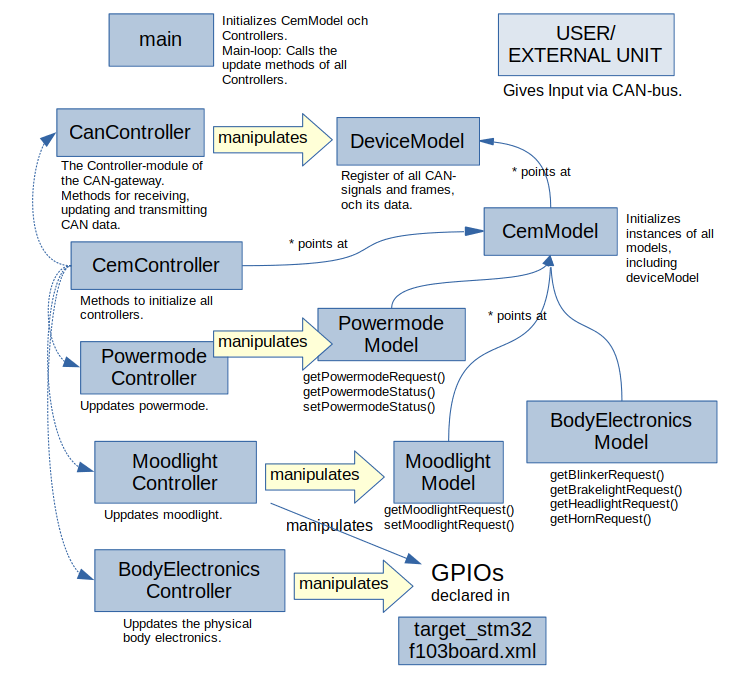
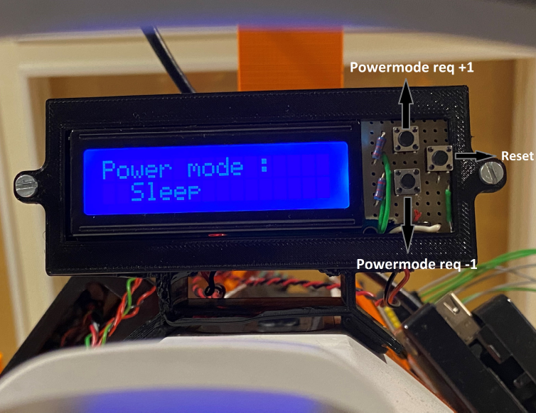

# Gokart Body Electronics 

In this page you can the source code repository for different components of the system.

#### [VCU](https://gitlab.infotivlab.se/internal-development/autonomous-platform/Gokart/Gokart-BE/cantx-rig)

The VCU is continuously sending wheel speed data to the CAN-bus. It is listening to the CAN bus for speed and turn rate requests and sends them to the PID which eventually modifies the values.

#### [CEM for Infotiv AP Gokart](https://gitlab.infotivlab.se/internal-development/autonomous-platform/Gokart/Gokart-BE/gk-cem) and [CEM](https://gitlab.infotivlab.se/internal-development/autonomous-platform/cem)

The CEM listens to the CAN bus and analyses each message. Based on a list of signals it matches the messages to a certain instruction, e.g. a certain message type is set speed, so it forwards the message onto the propulsion CAN bus for the VCU to handle. The CEM is the central module that keeps track of the state of the entire platform.

##### Model-view-controller
The CEM and SSM are both coded in C++ in the Infotiv Embedded Framework. The system architecture used is Model-view-controller (MVC), a software pattern that aims at separating the data (model) from the parts of the code that alters the data (controller), as well as the presentation of the data (view).

In a typical scenario a user gives input to a program on a computer. This input is handled by the controllers methods to manipulate the data in the model. Model is invisible for the user, but the model is responsible for updating view, which is the graphical interface for feedback to the user. In view the data is rendered to a suitable representation for the user.
The main argument for separating data from presentation is to avoid that changes in the presentation layer have consequences for the handling of data, and vice versa.
MVC is a design pattern that can vary a lot depending on the application. In the case of the CEM, where the presentation of the data could be said to lie in the physical body electronics outside of the microcontroller, a view layer in the code would be unnecessary. Worth noting is also that the input to the controller of the CEM does not come directly from the user, but from some other external unit, like the ADAS, VCU or DIM, which all have their own models and controllers. The user is in other words one ore more steps away compared to the typical scenario above.

A takeaway is that when it comes to the models, even though there are more than one model, they all point back to the one instance of the deviceModel that is initialized by the CemModel. The DeviceModel is the register of the CAN-bus(es) and its signals and frames, and when initiated, the data that each signal holds.
Looking at the controllers, there is a similar hierarchy in how the CemController has its only function to initialize all the other controllers. Also note that it points to the CemModel to make sure that the signals controlled are those in the one instance of the deviceModel.
The main code is simple – after initializing a cemModel and cemController that initializes everything else, the code iterates over a list of all controllers and calls their update-functions.

#### SSM 
The ECU responsible for handling the sonar sensors and putting their distance data on the CAN-bus follows the same MVC architecture (without view) as the CEM, only much simpler, with just a SonarModel that points at the DeviceModel, and a SonarController that manipulates the data in the SonarModel.

#### DIM code

The Powermode display is built on an arduino nano with C code including the transmit/receive configuration for the CAN communication to the MCP2515 underneath the Powermode buttons.

# Gokart Platform

#### [Gokart_VCU](https://gitlab.infotivlab.se/internal-development/autonomous-platform/Gokart/Gokart_vcu)

#### [ADAS]
On boot the ADAS launches its server. The server script, car_server.py, starts two threads, one publisher thread and one reply thread. The publisher thread publishes sensor data and the reply thread awaits commands and then executes the commands. 
The two reply threads are used for slightly different things. One is used to send set speed/turn rate commands to the ADAS and to forward I/O messages to the CEM. The other is used to send config data to whatever infotainment system require it.

#### [adas_dk](https://gitlab.infotivlab.se/internal-development/autonomous-platform/adas_dk)
The ADAS  software is written in Python while the ADAS DK aswell as the other ECU’s software is written in C++. 

#### [bms](https://gitlab.infotivlab.se/internal-development/autonomous-platform/bms)
The BMS is continuously sending information regarding voltage and current onto the CAN bus. It is also listening on the CAN bus for power mode signals which it handles by switching relays in order to give power to the motor.

#### SW drivers
Drivers for the CAN-Bus module need to be installed on the raspberry.
The drivers as well as instructions on how to install them are available at the [infotiv wiki](https://wiki.infotivlab.se/bin/view/Autonomous%20Platform/Configuring%20CAN%20on%20Raspberry%20Pi/)

#### [Gokart_signal_db](https://gitlab.infotivlab.se/internal-development/autonomous-platform/Gokart/Gokart_signal_db)

Signal database for CAN bus of the IES Gokart.

The signal database is an excel file, containing signal and frame definitions for
the CAN bus. Signals are all the data that can be communicated, and the 
frames are how it's done.

The name and description is for developer use mostly. 
The ID is in hex, and needs to be unique for the bus. To add signals to the frame, 
add the signal indexes from the 'signals' sheet to the 'signals' column as a 
comma separated list.

The 'Period' column specifies the rate at which the data should be sent, where a 
period of 0.01 is equivalent to 100 Hz.

The 'Bus' column is used to differentiate buses in the case there are several on 
the platform. At the time of writing there is only one, so this can always be left as 1.

#### [RosCanBus](https://gitlab.infotivlab.se/internal-development/autonomous-platform/Gokart/roscanbus)

A CAN bus ROS node that will transcode CAN signals to ROS topics according to a predefined CAN database.

#### [Car Controller](https://gitlab.infotivlab.se/internal-development/autonomous-platform/car_controller)

This repository consists of all files required to make the CarController python package. This python library contains all the essential functions to send and retrieve data from the autonomous platform while working from a remote client. Through this repo, a python package can be made and installed on the remote client or a laptop. The package acts as a backend communication interface to any commands which the user wants to send from the laptop to the autonomous platform regardles of the hardware on it.

The following features have been tested and functioning:

1) Handles all the wireless communication through [zmq](https://github.com/zeromq/pyzmq)
2) Gets the current signal information from the car.
3) The power to the motors can be switched on and off. The speed and turnrate can be set
4) Supports communication with one camera on board.
5) Takes input from the lidar and generates a map through SLAM.
6) When successfully connected to the server on the autonomous platform, this program will send out a heartbeat to indicate the health of the whole ADAS unit.
  

#### [Gokart_Controller](https://gitlab.infotivlab.se/internal-development/autonomous-platform/Gokart/Gokart_controller)

Python wrapper to communicate with ROS using rospy library.

#### [Gokart_power_mode_display](https://gitlab.infotivlab.se/internal-development/autonomous-platform/Gokart/Gokart_mood_display)

#### [NVIDIA Jetson Setup files, Gokart_setup](https://gitlab.infotivlab.se/internal-development/autonomous-platform/Gokart/Gokart_setup)

ROS subproject containing all setup for the Gokart. (Configuration files, script to launch services on startup )

This repo contains the launch files for starting the Cartographer nodes.  
It also contains the systemd services used for running `roscore`, `rplidar`, and `usb_cam`.  
There is a file in the services folder which defines udev rules, which allow us to bind the  
lidars to `/dev/lidar/*` which is convenient.

The `urdf` folder contains the URDF (Universal Robot Definition File) for the Gokart.

The main launch file used is `dobby.launch`. It will connect to the cars sensors  
and start up a graphical session in rviz displaying the Cartographer node's work.

#### [cartographer_ws](https://gitlab.infotivlab.se/internal-development/autonomous-platform/Gokart/cartographer_ws)

ROS workspace to get cartographer up and running with the IES Gokart.

This is intended to be run on a laptop which connects to the Gokart over wifi,  
not on the Gokart itself. Cartographer can certainly run on the Gokart, but  
this repositories scripts assume that you have a graphical user interface.  

Note that this project contains subrepositories! Remember to initialize them
using  
`git submodule update --init`

There are some shell scripts to help you out when getting started:

* **get_carto.sh** will download all files required to build cartographer
* **build_carto.sh** will build the downloaded files
* **run_carto.sh** will run the cartographer nodes

#### [Sonar Sensor Module for Gokart](https://gitlab.infotivlab.se/internal-development/autonomous-platform/Gokart/Gokart-ssm)

#### [urdf file](https://gitlab.infotivlab.se/internal-development/autonomous-platform/Gokart/urdf)
This repo contains the URDF file for the Gokart.

The URDF contains all geometrical definitions needed for the robot; eg where all the sensors are mounted. Read more creating your own urdf file [here](http://wiki.ros.org/urdf/Tutorials/Create%20your%20own%20urdf%20file). 

#### [TEM](https://gitlab.infotivlab.se/internal-development/autonomous-platform/tem)
This camera submodule should be run on the Raspberry Pi, server running on port 5557
Follow instruction to enable CAN drivers on Raspberry Pi

#### [lidarServer](https://gitlab.infotivlab.se/internal-development/autonomous-platform/lidarserver)

- publish_port = 5553
- command_port = 5554

#### [researchplatform](https://gitlab.infotivlab.se/internal-development/autonomous-platform/researchplatform)
running on PI

#### [ROS platform](https://gitlab.infotivlab.se/internal-development/autonomous-platform/rosplatform)
#### [camera Server](https://gitlab.infotivlab.se/internal-development/autonomous-platform/camera_server)
This camera submodule should be run on the Raspberry Pi, running on port 5557

Also see [camera_view](https://gitlab.infotivlab.se/internal-development/autonomous-platform/camera_view)

#### [car_protobufs](https://gitlab.infotivlab.se/internal-development/autonomous-platform/car_protobufs)

#### [Car_server](https://gitlab.infotivlab.se/internal-development/autonomous-platform/car_server)

See diagrams in the note folder

