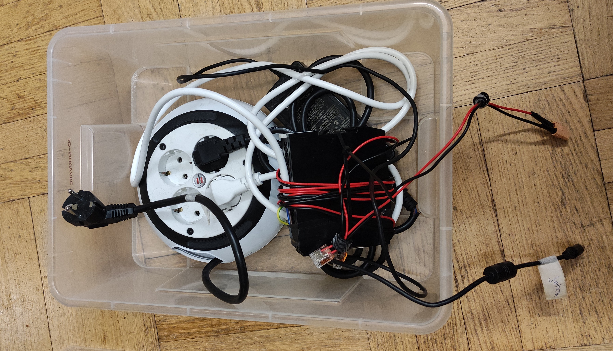
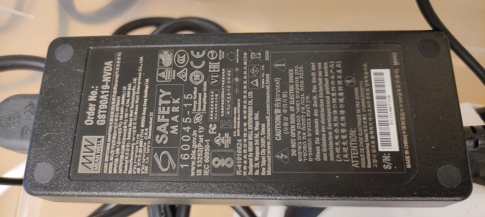
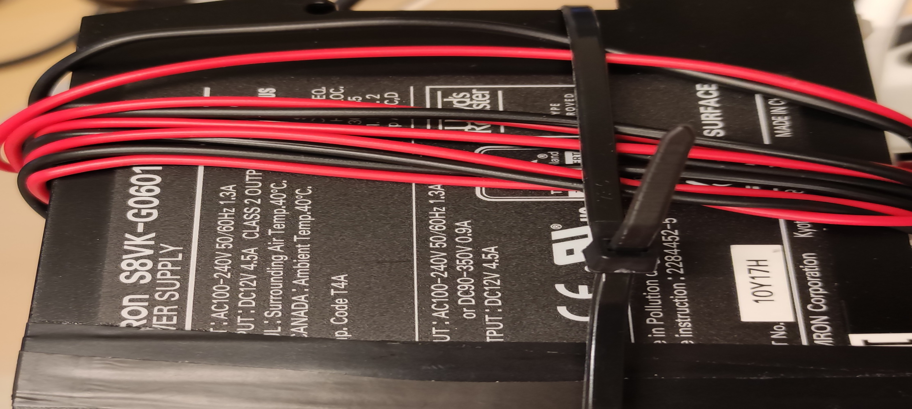
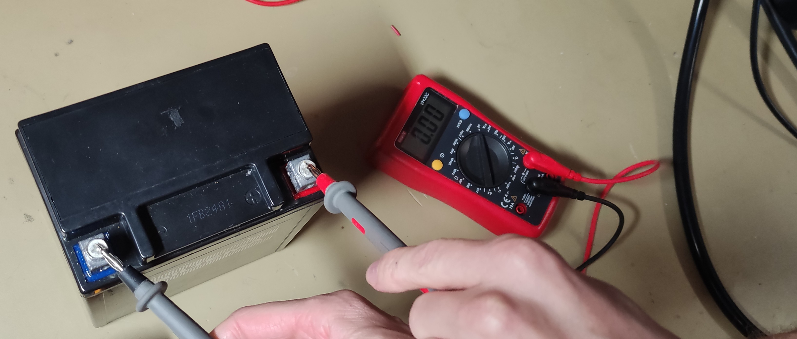

### Caution
You cannot turn off the go-kart when the wheel is active. Make sure to stop it either using the RC controller or the command below:

```bash
rostopic pub Speed_Request_Speed std_msgs/Float32 0
```

# Turning on the GoKart

Find all hosts in the network with open ssh port:
```bash
nmap -Pn -p22 192.168.150.1/24 -oG - | grep "/open" | awk '{ print $2 }'
```
ssh fingerprint:
```bash
ssh -X gokart1@dobby.local
ECDSA key fingerprint is SHA256:GkO/qyuwj+tCfwaZArQbMS8XsPUA4gfbMJdeTnqG1n4.
```

## Wifi interface
By default, the jetson board is configured to first connect to `TP-LINK_POCKET_3020_BCA5FA` and then `Infolab2` wifi network. 

The credential for the network is available on the device (default password) and in 
`/protectedDocuments/Credential.txt` **([Protected document](contact.md))**

an IP in the range of 192.168.150.X is usually assigned to the client in `Infolab2` wifi network.

an IP in the range of 192.168.0.X is usually assigned to the client (192.168.0.00 for the laptop) in `TP-LINK_POCKET_3020_BCA5FA` wifi network.
p
```
nmcli c s Infolab2 
ifconfig
wlan0: flags=4163<UP,BROADCAST,RUNNING,MULTICAST>  mtu 1500
        inet 192.168.150.120  netmask 255.255.255.0  broadcast 192.168.150.255
        inet6 fe80::5b07:dc97:a15c:2dd2  prefixlen 64  scopeid 0x20<link>
        ether 00:04:4b:f8:0e:d9  txqueuelen 1000  (Ethernet)
        RX packets 2545  bytes 526525 (526.5 KB)
        RX errors 0  dropped 0  overruns 0  frame 0
        TX packets 2416  bytes 536254 (536.2 KB)
        TX errors 0  dropped 0 overruns 0  carrier 0  collisions 0

TP-LINK_POCKET_3020_BCA5FA
wlan0: flags=4163<UP,BROADCAST,RUNNING,MULTICAST>  mtu 1500
        inet 192.168.0.200  netmask 255.255.255.0  broadcast 192.168.0.255
        inet6 fe80::9d56:f87a:2b29:8d97  prefixlen 64  scopeid 0x20<link>
        ether 00:04:4b:f8:0e:d9  txqueuelen 1000  (Ethernet)
        RX packets 9008  bytes 646052 (646.0 KB)
        RX errors 0  dropped 0  overruns 0  frame 0
        TX packets 9117  bytes 741776 (741.7 KB)
        TX errors 0  dropped 0 overruns 0  carrier 0  collisions 0
```

## Access to the camera remotely

After updating the configuration file `rtsp-simple-server.yml` as below

```txt
paths:
  cam:
    runOnInit: ffmpeg -f v4l2 -i /dev/video1 -preset ultrafast -b:v 600k -f rtsp rtsp://localhost:$RTSP_PORT/$RTSP_PATH
    runOnInitRestart: yes
```
Execute rtsp-simple-server_v0.19.1_linux_arm64v8/ server:
```bash
./rtsp-simple-server
```

```bash
vlc -vvv --network-caching 200 rtsp://192.168.150.120:8554/cam
```

## Power supply 
Inside the lab, for safety reasons related to charging batteries, it is recommended to power the system by plugging the appliance into an outlet.
S8VK-G06012 power supply with XT60 connector provides DC 12V 4.5A to power both VCU and the steering motor, *HOWEVER* when the wheel starts moving the jetson does not recieve enough power and restarts. So please use GST90A19-NVDA which separately provides 19V 4.7A to power Nvidia Jetson board.







Power usage measurements:
2.2 amps on peak (Jetson and motors working at the same time)
12 V 

## Battery 

For on-road test, Biltema MC-batteri SMF, 12 V, 14 Ah, 135 x 90 x 166 mm (Artnr. 80-271) with XT60 connector can be used. (XT90 connector can be connected if powering body electronics is also necessary)


- Charge the battery under during working hours and under supervision.
- The battery probably works with no issue for few hours and it has to be rechanrged if the voltage is dropped below 10. 



## Remote control

The right panel can be used to move forward and make quick brakes. To reverse, double back (brake) and reverses the gear. (it is noticeable from the beeping sound)


## On-road test checklist

- Laptop Charger (Dell, USB-C)
- Power supplies (2)
- Access point and its power supply
- mouse, keyboard (dongle), monitor
- ST-LINK/V2 and extra STM32F103C8T6
- Remote control
- Batteries
- Extra segway
- USB hub

The wheel should moves 3 times in different stage of startup:

- When the VCU boots (issue? make sure that VCU is powered directly and not via ST-LINK/V2) 
- When Jetson bootsup
- When Openpilot starts (issue? make sure both the openpilot system and jetson are  connected to the right access-point)
